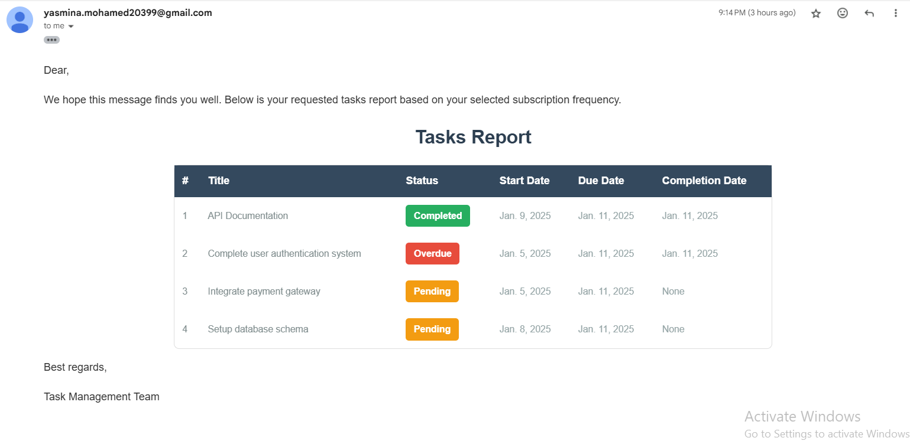

# Task Management and Report Subscription System

## Project Overview

The **Task Management and Report Subscription System** allows users to effectively manage tasks and subscribe to automated reports. Users can receive scheduled email summaries based on their selected frequency (daily, weekly, or monthly). The system includes robust user authentication and authorization to ensure that only authenticated users can access specific endpoints.

## Features
  - User Authentication: Secure signup, login, and token-based authentication using JWT.
  - Task Management: Create, update, delete, restore, batch delete and retrieve tasks with support for filtering by status, date range, and more.
  - Subscription Management: Subscribe or unsubscribe from task summary reports.
  - Generate Reports: Automated email reports for task summaries based on user-defined schedules.

## Setup Instructions

### Prerequisites

- Docker: Ensure Docker Desktop is installed and running.
- Docker Compose: Installed with Docker Desktop.
- Python 3.12 or later (for local development without Docker).

## Setup Instructions

Follow these steps to set up and run the project locally.

1. Clone the repository:
   - Start by cloning the repository to your local machine:
   ```bash
   git clone https://github.com/YasminaMohamed99/Task-Management-and-Report-Subscription-System.git
   cd task-management-system
   ```
2. Open Docker Desktop.
   - Ensure that Docker is running on your machine. If not, open Docker Desktop.

3. Build and start the Docker containers
   - To build and start the Docker containers, execute the following command:
   ```bash
     docker-compose up --build
   ```
4. Run Migrations and Create SuperUser
   - Once the containers are up, access the web container and run the migrations, then create a superuser for the Django admin:
   ```bash
      docker-compose exec web bash
      python manage.py migrate
      python manage.py createsuperuser
   ```
5. Start the Application
   - To start the application, use the following command:
   ```bash
      docker-compose up
   ```
6. Run Celery Workers and Scheduler for Email Notifications
   - To start the Celery worker and scheduler to send emails and generate reports, run the following commands:
   ```bash
    docker-compose exec web celery -A task_management worker --loglevel=info
    docker-compose exec web celery -A task_management beat --loglevel=info
      ```
7. Access the Swagger API Documentation
   - Once the containers are up and running, you can view the Swagger API documentation by navigating to the following URL in your browser
      ```bash
         http://localhost:8000/swagger/
      ```
8. Stopping the Containers
   - To stop the running containers, use the following command
 ```bash
    docker-compose down
 ```


## API Documentation

1. ### User Authentication
   ***Sign Up***: 
   - This API allows users to sign up by providing a username, email, and password, with validation to prevent duplicate sign-ups using the same email address. The password must meet specific security criteria to ensure the safety of user accounts.
     - **Endpoint:**
        ```
        POST /api/users/signup
        ```
     - **Request Body:**
         To create a new user, send a POST request with the following JSON payload:
          ```
             {
              "username": "username",
              "email": "user@example.com",
              "password": "Password@123"
             }
        ```
     - **Validation Rules:**
         - email and password required fields
         - Email must be email address validation
         - Minimum Length: The password must be at least 8 characters long.
         - Contains a Digit: The password must contain at least one digit.
         - Contains a Lowercase Letter: The password must contain at least one lowercase letter.
         - Contains an Uppercase Letter: The password must contain at least one uppercase letter.
         - Contains a Special Character: The password must contain at least one special character (e.g., !, @, #, etc.)..
     
     - **Returns:**
        - On success, returns `User created successfully` with status 201.
        - On failure, returns `Bad Request - Validation errors` with status 400.
        - Internal Server Error returns status 500.
        - 
     ***Sign In***:
       - Authenticates a user using email and password. If the credentials are valid, it generates a JWT access token and a refresh token. The access token expires 60 minutes after generated. If the credentials are invalid or the user does not exist, an error message is returned.
       - **Endpoint:**
         ```
         POST /api/users/signin
         ```
       - **Request Body:**
          To create a new user, send a POST request with the following JSON payload:
           ```
              {
               "username": "username",
               "email": "user@example.com",
               "password": "Password@123"
              }
         ```
       - **Validation Rules:**
          - email and password required fields
       - **Returns:**
         - On success, returns `Login Successfully` with status 200.
         - On failure, returns `Bad Request` with status 400 and error messages.
         - Unauthorized User - returns status 401.
         - Internal Server Error returns status 500.
     
2. ### Task Management API
     ***Create Task***
      - Creates a new task with the provided details.
      - **Endpoint:**
           ```
           POST /api/tasks/create
           ```
      - **Request Body:**
         To create a new task, send a POST request with the following JSON payload:
          ```
             {
                "title": "Complete user authentication system",
                "description": "Implement and test user login, registration, and password reset functionality.",
                "start_date": "2025-01-10",
                "due_date": "2025-01-11",
                "status": "Completed"
             }
        ```
      - **Validation Rules:**
         - title, description, start_date, due_date all fields required
         - title must be unique across all tasks for each user.
         - start_date must be earlier than or equal to due_date and completion_date if exists.
      - **Returns:**
         - On success, returns the created task with status 201.
         - On failure, returns validation errors with status 400.
         - Unauthorized User - returns status 401.
         - Internal Server Error returns status 500.

   ***Retrieves Task***
      - Retrieves a list of tasks filtered by the provided parameters or all tasks owned by the authenticated user.

      - **Endpoint:**
           ```
           GET /api/tasks/retrieve_tasks/
           ```
      - **Parameters:**
          - `status`: (Optional) Filter tasks by their status (`Pending`, `Completed`, `Overdue`).
          - `start_date`: (Optional) Filter tasks that start on or after this date (format: YYYY-MM-DD).
          - `end_date`: (Optional) Filter tasks that end on or before this date (format: YYYY-MM-DD). This filter works as follows:
               - If a task has a completion_date, it will be included if the completion_date is less than or equal to the provided end_date.
               - If a task does not have a completion_date but has a due_date, it will be included if the due_date is less than or equal to the provided end_date.
      - **Returns:**
         - A filtered list of tasks based on the provided parameters, or all tasks if no parameters are provided.
         - Returns a 400 Bad Request response if invalid parameters are provided with error messages.
         - Unauthorized User - returns status 401.
         - Internal Server Error returns status 500.

   ***Update Task***
      - The task can only be updated by its owner. If the status field is changed to a completed or overdue status, the completion_time field will be automatically updated to the current date.

      - **Endpoint:**
           ```
           PUT /api/tasks/update/{id}/
           PATCH /api/tasks/update/{id}/
           ```
      - **Request Body:**
         - To update task, send a PUT request with the following JSON payload or PATCH request with partial update:
          ```
             {
                "title": "Complete user authentication system",
                "description": "Implement and test user login, registration, and password reset functionality.",
                "start_date": "2025-01-10",
                "due_date": "2025-01-11",
                "status": "Completed"
             }
        ```
      - **Validation Rules:**
         - title must be unique across all tasks for each user.
         - start_date must be earlier than or equal to due_date and completion_date if exists.
         - Updated task by its owner.

      - **Returns:**
         - On success, returns `Task updated successfully.` with status 200.
         - On failure, returns `Bad Request - Invalid data provided or update failed.` with status 400 and error messages.
         - Unauthorized User - returns status 401.
         - Permission Denied - `You do not have permission to access this task` with status 403.
         - `Task doesn't exist.` with status 404
         - Internal Server Error returns status 500.

   ***Delete Task***
      - Soft delete a task by its ID. and only the task owner can delete the task. If the task is already deleted or not found, returned message that show that.
      - **Endpoint:**
           ```
           DELETE /api/tasks/delete/{id}/
           ```
      - **Validation Rules:** 
         - Deleted task by its owner.
        
      - **Returns:**
         - On success, returns `Task deleted successfully.` with status 204.
         - On failure, returns `Bad Request - Invalid task ID.` with status 400 and error messages that show errors.
         - Unauthorized User - returns status 401.
         - Permission Denied - `You do not have permission to access this task` with status 403.
         - `Task doesn't exist.` with status 404
         - Internal Server Error returns status 500.

   ***Restore Task***
      - Restore the last deleted task for the logged-in user.

      - **Endpoint:**
           ```
           POST /api/tasks/restore/
           ```
      - **Returns:**
         - On success, returns `Last deleted task restored successfully.` with status 200.
         - Unauthorized User - returns status 401.
         - `No deleted tasks found.` with status 404
         - Internal Server Error returns status 500.
   
   ***Batch Delete***
      - Batch delete tasks within a specified date range. If no date range is provided, all tasks of the authenticated user will be deleted.
   
      - **Endpoint:**
           ```
           DELETE /api/tasks/batch-delete/
           ```
      - **Parameters:**
          - `start_date`: (Optional) Filter tasks that start on or after this date (format: YYYY-MM-DD).
          - `end_date`: (Optional) Filter tasks that end on or before this date (format: YYYY-MM-DD). This filter works as follows:
               - If a task has a completion_date, it will be included if the completion_date is less than or equal to the provided end_date.
               - If a task does not have a completion_date but has a due_date, it will be included if the due_date is less than or equal to the provided end_date.
      - **Returns:**
         - On success, returns `Tasks successfully deleted.` with status 204.
         - On failure, returns `Bad Request - Invalid date format. Use YYYY-MM-DD` with status 400 and error messages that show errors.
         - Unauthorized User - returns status 401.
         - `No tasks found in the given date range.` with status 404
         - Internal Server Error returns status 500.
        
3. ### Subscription API
   ***Subscribe:***
      - subscribes the user or confirms an existing subscription.
         - If the user is not already subscribed, a new subscription is created with the provided data.
         - If the user is already subscribed, a message indicating that is returned.
      - **Endpoint:**
           ```
           POST /api/subscribe/
           ```
      - **Request Body:**
         To subscribe to reports, send a POST request with the following JSON payload:
          ```
             {
                "start_date": "2025-01-01 09:00:00",
                "frequency": "weekly",
                "report_time": "09:00"
             }
         ```
      - **Validation Rules:**
         - start_date:
            - Must be required
            - Must be in the format 'YYYY-MM-DD HH:00:00'.
            - Example: "2025-01-01 09:00:00"
         - frequency: Must be required, and it is one of the following values: 'daily', 'weekly', 'monthly'.
         - report_time:
           - Must be required
           - Must be in a valid time format of 'H:00:00', 'H:00', 'H', H (24-hour format) or 'H AM/PM
           - Example: "9 AM", "9PM", "09:00:00","18:00", "18", 18 (24-hour format).

      - **Returns:**
         - On success, returns `User has been successfully subscribed.` with status 201.
         - With status 200, returns `User is already subscribed.`
         - On failure, returns validation errors with status 400.
         - Unauthorized User - returns status 401.
         - Internal Server Error returns status 500.
   
   ***UnSubscribe:***
      - Unsubscribe the user if you have an active subscription. .
      - **Endpoint:**
           ```
           DELETE /api/subscribe/
           ```
      - **Returns:**
         - On success, returns `User has been successfully unsubscribed.` with status 200.
         - `No active subscription found.` with status 404
         - Unauthorized User - returns status 401.
         - Internal Server Error returns status 500.

4. ### Report Generation
  The system generates task reports and sends them via email according to the user's subscription preferences. The process involves:

  1) Report Generation: A Celery task retrieves the user's tasks, generates a summary report, and saves it.
  2) Email Delivery: The generated report is attached to an email and sent to the user's registered email address.
  3) Frequency Options: Users can choose to receive reports daily, weekly, or monthly.

Below is a sample screenshot of an automatically generated email report:


